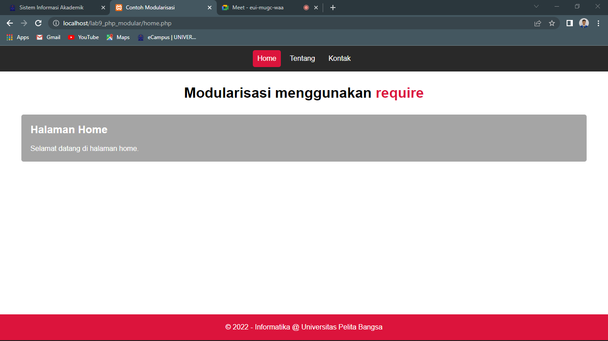
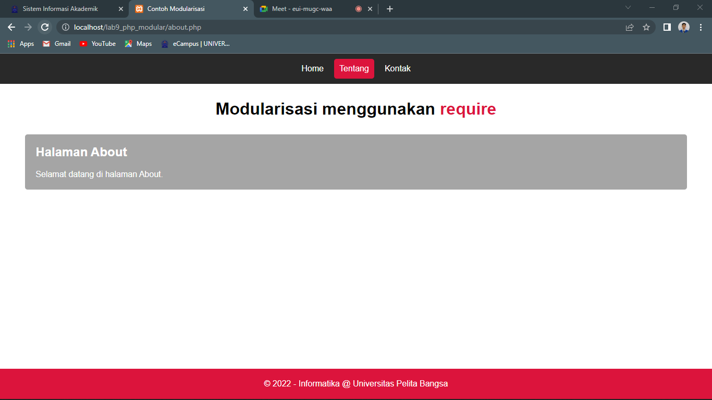
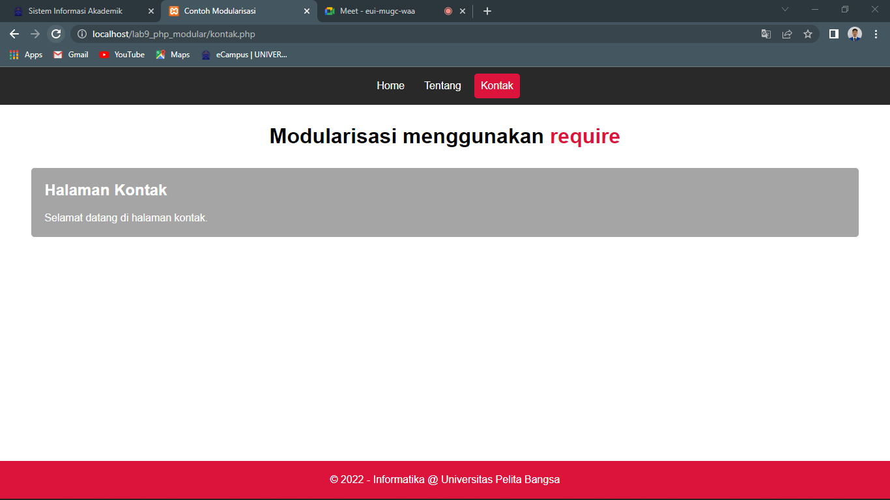

# Tugas Lab 9 Web

## Profil
| # | Biodata |
| -------- | --- |
| **Nama** | Reza Riyaldi Irawan |
| **NIM** | 312010284 |
| **Kelas** | TI.20.A.2 |
| **Mata Kuliah** | Pemrograman Web |

## Langkah 1 `Persiapan`
1. Buat file baru bernama `header.php`, lalu tambahkan kode berikut.

```php
<?php
$active = basename($_SERVER['PHP_SELF'], ".php");
?>
<!DOCTYPE html>
<html lang="en">

<head>
    <meta charset="UTF-8">
    <meta http-equiv="X-UA-Compatible" content="IE=edge">
    <meta name="viewport" content="width=device-width, initial-scale=1.0">
    <title>Contoh Modularisasi</title>
    <link rel="stylesheet" href="style.css">
</head>

<body>
    <div class="container">
        <nav>
            <a href="home.php" class="<?= $active == 'home' ? 'active' :''?>">Home</a>
            <a href="about.php" class="<?= $active == 'about' ? 'active' :''?>">Tentang</a>
            <a href="kontak.php" class="<?= $active == 'kontak' ? 'active' :''?>">Kontak</a>
        </nav>
        <header>
            <h1>Modularisasi menggunakan <code>require</code></h1>
        </header>
```

2. Buat file baru bernama `footer.php`, lalu tambahkan kode berikut.

```html
        <footer>
            <p>&copy; 2022 - Informatika @ Universitas Pelita Bangsa</p>
        </footer>
    </div>
</body>

</html>
```

3. Buat file baru bernama `home.php`, lalu tambahkan kode berikut.

```php
<?php require "header.php"; ?>

<div class="content">
    <h2>Halaman Home</h2>
    <p>Selamat datang di halaman home.</p>
</div>

<?php require "footer.php"; ?>
```

4. Buat file baru bernama `about.php`, lalu tambahkan kode berikut.

```php
<?php require "header.php"; ?>

<div class="content">
    <h2>Halaman About</h2>
    <p>Selamat datang di halaman about.</p>
</div>

<?php require "footer.php"; ?>
```

5. Buat file baru bernama `kontak.php`, lalu tambahkan kode berikut.

```php
<?php require "header.php"; ?>

<div class="content">
    <h2>Halaman kontak</h2>
    <p>Selamat datang di halaman kontak.</p>
</div>

<?php require "footer.php"; ?>
```

6. Agar tampilan menarik tambahkan sedikit style.

```css
* {
    padding: 0;
    margin: 0;
    font-family: "Roboto", sans-serif;
}

nav {
    width: 100%;
    background-color: rgb(41, 41, 41);
    padding: 0px;
    display: flex;
    align-items: center;
    justify-content: center;
}

nav > a {
    text-decoration: none;
    color: white;
    padding: 10px;
    margin: 10px 5px;
    border-radius: 5px;
}

nav > a:hover, nav > a.active{
    background-color: crimson;
}

header {
    text-align: center;
    padding: 30px;
}

header code {
    color: crimson;
}

.content {
    background-color: rgb(165, 165, 165);
    color: white;
    width: 90%;
    margin: auto;
    padding: 20px;
    border-radius: 5px;
}

.content h2 {
    margin-bottom: 20px;
}

footer {
    position: absolute;
    bottom: 0;
    width: 100%;
    background-color: crimson;
    text-align: center;
    padding: 20px 0;
    color: white;
}
```

7. Maka hasilnya akan seperti berikut.
    - Halaman Home
    

    - Halaman About
    

    - Halaman Kontak
    


## Pertanyaan & Tugas
Implementasikan konsep modularisasi pada kode program **Praktikum 8** tentang database, sehingga setiap halaman memiliki template tampilan yang sama.

## Praktek
1. Import folder Lab8Web.
2. Lalu tambahkan folder `layouts`.
3. Didalam folder `layouts` buat file bernama `_header.php` dan `_footer.php`.
4. Untuk `_header.php` tambahkan kode berikut.

```html
<!DOCTYPE html>
<html lang="en">

<head>
    <meta charset="UTF-8">
    <meta http-equiv="X-UA-Compatible" content="IE=edge">
    <meta name="viewport" content="width=device-width, initial-scale=1.0">
    <title>CRUD Sederhana | READ</title>

    <link rel="stylesheet" href="https://cdn.jsdelivr.net/npm/bootstrap@5.2.0-beta1/dist/css/bootstrap.min.css">
</head>

<body>
    <div class="container">
```

5. Untuk `_footer.php` tambahakn kode berikut.

```html
</div>

<footer class="bg-dark text-center text-white p-2 w-100" style="position: absolute; bottom: 0">
    <p class="m-0">&copy; 2022 - Informatika @ Universitas Pelita Bangsa</p>
</footer>
</body>

</html>
```

6. Ubah kode pada `index.php` menjadi seperti berikut.

```php
<?php
include "koneksi.php";
require "layouts/_header.php";

$query = "SELECT * FROM tb_barang";
$result = mysqli_query($koneksi, $query);

?>
<h1 class="my-3 text-center">Data Barang</h1>
<a href="tambah.php" class="btn btn-success btn-sm mb-3">Tambah Barang</a>

<table class="table table-sm table-bordered">
    <tr class="text-center fw-bold text-uppercase">
        <td>No</td>
        <td>Gambar</td>
        <td>Nama</td>
        <td>Kategori</td>
        <td>Harga Beli</td>
        <td>Harga Jual</td>
        <td>Stok</td>
        <td>Aksi</td>
    </tr>
    <?php
    if ($result->num_rows > 0) {

        // die();
        $no = 1;
        while ($data = mysqli_fetch_array($result)) {
            // var_dump($data['nama_barang']);
    ?>
            <tr>
                <td class="text-center"><?= $no++ ?></td>
                <td class="text-center">" alt="gabisa" width="200px"></td>
                <td><?= $data['nama_barang'] ?></td>
                <td><?= $data['kategori_barang'] ?></td>
                <td>Rp. <?= $data['harga_beli'] ?></td>
                <td>Rp. <?= $data['harga_jual'] ?></td>
                <td><?= $data['stok'] ?></td>
                <td class="text-center">
                    <a href="ubah.php?id_barang=<?= $data['id_barang'] ?>" class="btn btn-warning btn-sm mx-1">Edit</a>

                    <a href="proses.php?id_barang=<?= $data['id_barang'] ?>&aksi=hapus" class="btn btn-danger btn-sm mx-1" onclick="return confirm('Apakah anda yakin ingin menghapus <?= $data['nama_barang'] ?> ?')">Delete</a>
                </td>
            </tr>
        <?php
        }
    } else {
        ?>
        <tr>
            <td colspan="8" class="text-center">Data Kosong</td>
        </tr>
    <?php
    }
    ?>
</table>

<?php require "layouts/_footer.php"; ?>
```

7. Ubah kode pada `tambah.php` menjadi seperti berikut.

```php
<?php require "layouts/_header.php" ?>
<div class="row m-0">
    <div class="col-md-5 mx-auto">
        <div class="card mt-3">
            <div class="card-header text-center">
                <h3>Tambah Barang</h3>
            </div>
            <div class="card-body">
                <form action="proses.php" method="post" enctype="multipart/form-data">
                    <div class="mb-3">
                        <label for="nama_barang" class="form-label">Nama Barang</label>
                        <input type="text" name="nama_barang" id="nama_barang" placeholder="Masukan nama barang" class="form-control">
                    </div>
                    <div class="mb-3">
                        <label for="kategori_barang" class="form-label">Kategori Barang</label>
                        <input type="text" name="kategori_barang" id="kategori_barang" placeholder="Masukan kategori barang" class="form-control">
                    </div>

                    <label for="harga_beli" class="form-label">Harga Beli</label>
                    <div class="input-group mb-3">
                        <span class="input-group-text">Rp.</span>
                        <input type="number" name="harga_beli" id="harga_beli" placeholder="Masukan Harga Beli" class="form-control">
                    </div>

                    <label for="harga_jual" class="form-label">Harga Jual</label>
                    <div class="input-group mb-3">
                        <span class="input-group-text">Rp.</span>
                        <input type="number" name="harga_jual" id="harga_jual" placeholder="Masukan Harga Jual" class="form-control">
                    </div>

                    <div class="mb-3">
                        <label for="stok" class="form-label">Stok</label>
                        <input type="number" class="form-control" name="stok" placeholder="Masukan Stok Barang">
                    </div>

                    <div class="mb-3">
                        <label for="gambar" class="form-label">Gambar</label>
                        <input type="file" name="gambar_barang" id="gambar" class="form-control form-control-sm">
                    </div>

                    <a href="index.php" class="btn btn-secondary">Kembali</a>
                    <button class="btn btn-success" name="tambah" type="submit">Tambah</button>
                </form>
            </div>
        </div>
    </div>
</div>

<?php require "layouts/_footer.php" ?>
```

8. Ubah kode pada `ubah.php` menjadi seperti berikut.

```php
<?php require "layouts/_header.php" ?>
<div class="row m-0">
    <div class="col-md-5 mx-auto">
        <div class="card mt-3">
            <div class="card-header text-center">
                <h3>Ubah Barang</h3>
            </div>
            <div class="card-body">
                <?php
                include "koneksi.php";

                $id = $_GET['id_barang'];
                $query = "SELECT * FROM tb_barang ";
                $query .= "WHERE id_barang = $id";

                $result = mysqli_query($koneksi, $query);
                $data = mysqli_fetch_array($result);
                ?>
                <form action="proses.php" method="post" enctype="multipart/form-data">
                    <input type="hidden" name="id_barang" value="<?= $id ?>">
                    <div class="mb-3">
                        <label for="nama_barang" class="form-label">Nama Barang</label>
                        <input type="text" name="nama_barang" id="nama_barang" placeholder="Masukan nama barang" class="form-control" value="<?= $data['nama_barang'] ?>">
                    </div>
                    <div class="mb-3">
                        <label for="kategori_barang" class="form-label">Kategori Barang</label>
                        <input type="text" name="kategori_barang" id="kategori_barang" placeholder="Masukan kategori barang" class="form-control" value="<?= $data['kategori_barang'] ?>">
                    </div>

                    <label for="harga_beli" class="form-label">Harga Beli</label>
                    <div class="input-group mb-3">
                        <span class="input-group-text">Rp.</span>
                        <input type="number" name="harga_beli" id="harga_beli" placeholder="Masukan Harga Beli" class="form-control" value="<?= $data['harga_beli'] ?>">
                    </div>

                    <label for="harga_jual" class="form-label">Harga Jual</label>
                    <div class="input-group mb-3">
                        <span class="input-group-text">Rp.</span>
                        <input type="number" name="harga_jual" id="harga_jual" placeholder="Masukan Harga Jual" class="form-control" value="<?= $data['harga_jual'] ?>">
                    </div>

                    <div class="mb-3">
                        <label for="stok" class="form-label">Stok</label>
                        <input type="number" class="form-control" name="stok" placeholder="Masukan Stok Barang" value="<?= $data['stok'] ?>">
                    </div>

                    <div class="mb-3">
                        <label for="gambar" class="form-label">Gambar</label>
                        <input type="file" name="gambar_barang" id="gambar" class="form-control form-control-sm" value="<?= $data['gambar_barang'] ?>">
                    </div>

                    <a href="index.php" class="btn btn-secondary">Kembali</a>
                    <button class="btn btn-warning" name="ubah" type="submit">Ubah</button>
                </form>
            </div>
        </div>
    </div>
</div>

<?php require "layouts/_footer.php" ?>
```